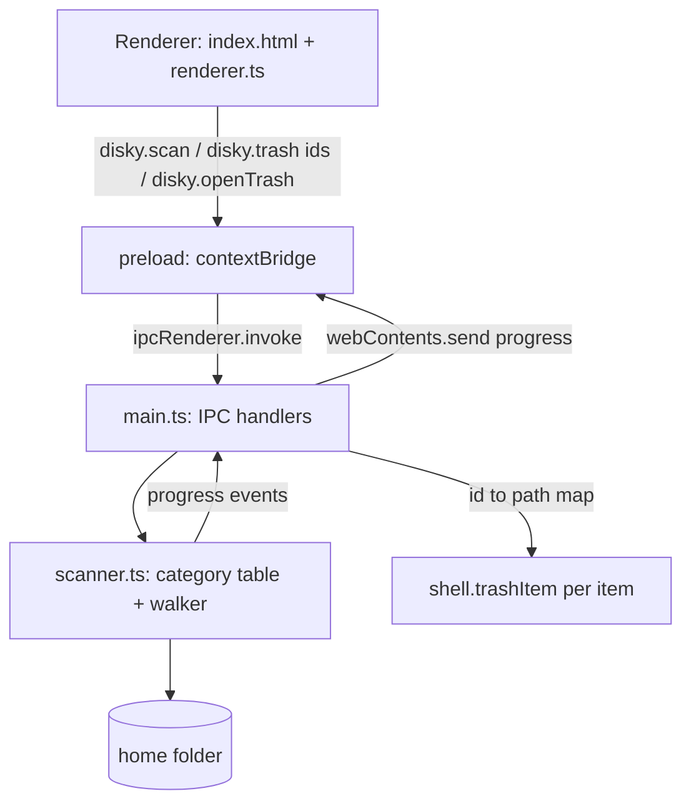
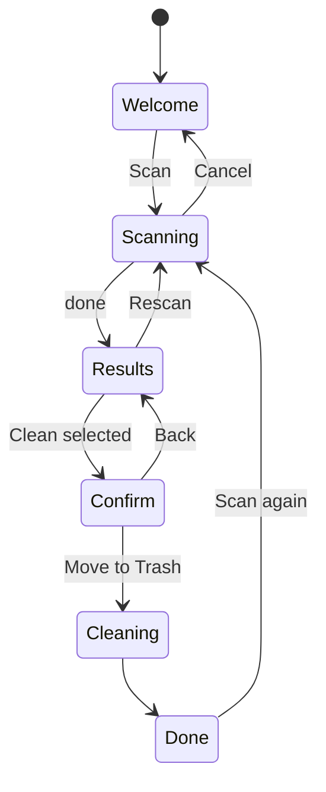

# feat: disky desktop app for non-technical users

## Summary

Move the existing CLI into `cli/` and add an Electron desktop app in `app/` for non-technical macOS and Windows users. The app scans the user's home folder, groups what it finds into plain-language categories with sizes, and moves ticked items to the Trash / Recycle Bin. First build is free, unsigned, and has no payments.

---

## Problem Frame

The CLI targets developers (node_modules, Docker, build caches) and needs a terminal. Non-technical users need a double-click app that finds *their* clutter — big videos, old downloads, app caches, iPhone backups — and cleans it without risk of losing personal files. The owner has no Apple Developer or Windows signing budget, so distribution is unsigned downloads from a website.

---

## Requirements

**Repo layout**
- R1. Existing CLI code lives in `cli/` and still builds, links, and publishes as `@ishk9/disky`.
- R2. Desktop app lives in `app/` as an independent package with its own dependencies.

**Scanning**
- R3. One click scans the home folder and reports six categories: Large files, Old downloads, App & browser caches, Temporary files, iPhone backups, Trash.
- R4. Each category shows total size and an expandable list of items with name, location, size, and last-used date.
- R5. Scanning never follows symlinks/junctions, never downloads iCloud-only files, and never aborts on permission errors.
- R6. Scan shows live progress and can be cancelled.

**Cleaning**
- R7. Items are only ever moved to the OS Trash / Recycle Bin, never deleted permanently.
- R8. Cache and temp items are pre-ticked; personal files (large files, old downloads, iPhone backups) are never pre-ticked.
- R9. A confirmation step states item count and total size before anything moves.
- R10. Per-item failures (locked file, not recyclable) are reported without stopping the batch.
- R11. Trash category is informational: shows size and opens the OS Trash so the user empties it themselves.

**Platform and trust**
- R12. On macOS, when Full Disk Access or a folder permission (Desktop, Documents, Downloads) is missing, the app says which, explains why, and offers a button to the right System Settings pane; the rest of the scan still works.
- R13. App runs on macOS (Apple Silicon + Intel) and Windows 10/11 from unsigned installers.

**Design**
- R14. Single-window UI that follows OS light/dark mode, is fully keyboard-operable, meets WCAG AA contrast, respects reduced motion, and uses plain language (no paths or jargon up front).

---

## Key Technical Decisions

- KTD-1. **App gets its own scanner; no shared package with the CLI.** CLI detectors target developer folders and shell out to `du`/`rm`, which do not exist on Windows. Sharing would force a rewrite of both for no user-facing gain now.
- KTD-2. **Plain HTML/CSS/TypeScript renderer, no UI framework or bundler.** One screen with a handful of states does not need React; `tsc` alone keeps the toolchain to two dev dependencies beyond Electron.
- KTD-3. **Renderer sends item IDs, never paths.** Main keeps the last scan's `id → path` map and only trashes IDs from it. A compromised renderer cannot trash arbitrary paths.
- KTD-4. **`shell.trashItem` for all removals, one item at a time from main.** It rejects rather than permanently deleting when an item cannot be recycled on both OSes, which enforces R7 for free.
- KTD-5. **Size = allocated bytes (`blocks * 512`) on macOS, `size` on Windows.** Avoids counting iCloud "dataless" and sparse files as reclaimable. Files with `size > 0 && blocks === 0` count as 0.
- KTD-6. **Skip cloud roots and packages outright.** Never walk `~/Library/Mobile Documents`, `~/Library/CloudStorage`, or Windows OneDrive roots (`%OneDrive%`, `%OneDriveCommercial%`, `%USERPROFILE%\OneDrive*`): listing them can trigger downloads and online-only files free nothing. Never descend into package directories (`.app`, `.photoslibrary`, `.musiclibrary`, `.imovielibrary`, `.fcpbundle`, `.bundle`, `.pkg`); trashing a file inside one corrupts the library or app.
- KTD-7. **Secure Electron defaults, preload requires only `electron`.** `contextIsolation`, `sandbox`, no `nodeIntegration`, meta CSP `default-src 'self'`, `ipcMain.handle` with sender-frame check. Preload stays single-file CJS importing only `electron`, which survives the Electron 45 sandbox-preload restriction.
- KTD-8. **Categories are a data table, not classes.** Each entry: id, label, plain-language description, platform path resolver, item kind, pre-ticked flag. Adding a category is one table row.
- KTD-9. **Tests use `node:test`.** No test framework dependency; scanner tests run against temp-dir fixtures.
- KTD-10. **Unsigned packaging via electron-builder: `mac.identity: "-"` (ad-hoc), `hardenedRuntime: false`; Windows NSIS without cert.** Ad-hoc signing is required for Apple Silicon to launch the app at all.

---

## High-Level Technical Design

Process boundaries and data flow:



UI state machine:



Large files walk rules: walk home, skip hidden directories, `~/Library` (macOS), `AppData` (Windows), cloud roots and packages (KTD-6); report files at or above 500 MB that no other category already reports. Downloads is walked, so a big recent download lands here while an old one stays in Old downloads — each file appears exactly once.

---

## Output Structure

```text
cli/                      existing CLI, moved as-is
  package.json  tsconfig.json  README.md  src/
app/
  package.json            electron, electron-builder, typescript; build config
  tsconfig.json           main + preload (CommonJS)
  tsconfig.renderer.json  renderer (ES module, DOM lib)
  src/
    main.ts               window, IPC, trash
    preload.ts            contextBridge API
    scanner.ts            category table, walker, sizing
    scanner.test.ts
    trash.ts              id→path map, batch trash (no electron import)
    trash.test.ts
    renderer/
      index.html
      styles.css
      renderer.ts
  build/icon.png
.github/workflows/app-release.yml
README.md                 repo overview pointing at cli/ and app/
```

---

## Implementation Units

### U1. Move CLI into `cli/`

- **Goal:** Relocate CLI with history intact; repo root becomes a container.
- **Requirements:** R1
- **Dependencies:** none
- **Files:** move `src/`, `package.json`, `package-lock.json`, `tsconfig.json`, `README.md` into `cli/`; new root `README.md`; `.gitignore` (patterns already relative, confirm).
- **Approach:** Use `git mv` so blame survives. Root README is a short index. `docs/` stays at root. Global `npm link` currently points at repo root and must be redone from `cli/`.
- **Test expectation:** none — pure move; verified by build.
- **Verification:** `cli/` builds and type-checks; `disky scan --top 3` works after relinking from `cli/`.

### U2. App scaffold with secure window

- **Goal:** Electron app that opens one secure window showing a placeholder page.
- **Requirements:** R2, R13
- **Dependencies:** U1
- **Files:** `app/package.json`, `app/tsconfig.json`, `app/tsconfig.renderer.json`, `app/src/main.ts`, `app/src/preload.ts`, `app/src/renderer/index.html`
- **Approach:** Pin electron 44.x, electron-builder 26.x. Window: fixed sensible default size, min size, `backgroundColor` matching theme to avoid white flash, `show` on ready-to-show. Block navigation and `window.open`. CSP meta tag.
- **Patterns to follow:** Electron security checklist (see Sources).
- **Test expectation:** none — scaffolding; covered by launch check.
- **Verification:** `npm start` in `app/` opens the window; devtools shows no CSP or security warnings.

### U3. Scanner

- **Goal:** Pure Node module that returns categorized findings for the current platform, with progress and cancel.
- **Requirements:** R3, R4, R5, R6, R8, R12
- **Dependencies:** U2
- **Files:** `app/src/scanner.ts`, `app/src/scanner.test.ts`
- **Approach:** Category table (KTD-8) with per-platform resolvers:
  - Large files: walk per rules in HTD.
  - Old downloads: top-level entries of Downloads not modified in 90 days.
  - App & browser caches: macOS children of `~/Library/Caches`; Windows Chrome/Edge `Cache`, `Code Cache`, `GPUCache` dirs under each profile (`Default`, `Profile N`) in `User Data`.
  - Temporary files: children of `os.tmpdir()` not modified in the last 24 hours, regular files and directories only (no sockets or other special files), excluding the app's own temp files.
  - iPhone backups: macOS `~/Library/Application Support/MobileSync/Backup/*`; Windows `%APPDATA%\Apple Computer\MobileSync\Backup\*` and `%USERPROFILE%\Apple\MobileSync\Backup\*`.
  - Trash: macOS `~/.Trash` total; Windows Recycle Bin total via one PowerShell `Shell.Application` call. Size is `unavailable` (not 0) when it cannot be read.
  - Walker: `readdir` with file types plus `lstat`, bounded concurrency, skip links, treat `EPERM/EACCES/EBUSY/ENOENT/ELOOP` as inaccessible. Cancel via `AbortSignal`.
  - Permissions (macOS): probe `readdir(~/.Trash)`, which always exists and needs Full Disk Access; `EPERM` sets `needsFullDiskAccess`. `EPERM` on the Desktop, Documents, or Downloads root adds that folder to a `deniedFolders` list.
- **Test scenarios:**
  - Fixture dir with nested files returns total equal to sum of allocated sizes.
  - Symlink to a large file outside the fixture is not counted or followed.
  - Unreadable subfolder (chmod 000) is skipped and scan completes.
  - Old downloads: entry with mtime 91 days ago included, 89 days ago excluded.
  - Large files: with the threshold overridden to 1 MB, a 1 MB written file is included and a 1016 KB file (one 8 KB block under) is not; threshold compares allocated bytes.
  - Large file inside a `.photoslibrary` fixture directory is not reported; a large file in a cloud-root fixture is not reported.
  - Large file in Downloads modified yesterday appears in Large files; one modified 100 days ago appears only in Old downloads.
  - Temp entry modified 1 hour ago is excluded; one modified 2 days ago is included.
  - Sparse file (truncated to 10 MB, nothing written) counts as ~0 bytes on macOS.
  - Pre-ticked flag true for caches and temp, false for large files, old downloads, iPhone backups.
  - Aborting mid-scan rejects promptly with an abort error.
  - Category with missing root folder returns empty, not an error.
  - Unreadable (chmod 000) Trash fixture sets `needsFullDiskAccess: true` and Trash size `unavailable`; readable one leaves the flag false.
  - Unreadable Downloads root appears in `deniedFolders`; scan still completes.
- **Verification:** Tests pass; scanning a real home folder completes and totals roughly match Finder / Explorer for the same folders.

### U4. IPC and trash

- **Goal:** Wire scan, progress, cancel, trash, open-Trash, and open-Full-Disk-Access actions across the bridge.
- **Requirements:** R6, R7, R10, R11, R12
- **Dependencies:** U3
- **Files:** `app/src/trash.ts`, `app/src/trash.test.ts`; extend `app/src/main.ts` and `app/src/preload.ts` from U2
- **Approach:** Preload exposes `window.disky` with `scan()`, `cancel()`, `trash(ids)`, `openTrash()`, `openFullDiskAccess()`, `onProgress(cb)`. `trash.ts` is a pure module: holds the id→path map from the latest scan (KTD-3) and a batch function that takes the trash function as a parameter, trashes sequentially with `path.resolve`d paths, reports per-item progress, and returns per-id `{ ok, error, location }`. `main.ts` validates the sender frame and passes in `shell.trashItem`. Clear the map on rescan. Open-FDA uses the `x-apple.systempreferences` Privacy_AllFiles URL (folder permissions use the matching Files and Folders pane) and tells the user to reopen the app after granting; open-Trash opens `~/.Trash` or `shell:RecycleBinFolder`.
- **Test scenarios:**
  - ID resolution rejects ids not in the current map and ids from a previous scan.
  - Batch with one failing item returns ok for the others and an error entry for the failed one.
- **Verification:** From devtools, `disky.trash([unknown id])` moves nothing; trashing a real temp item puts it in the OS Trash.

### U5. UI

- **Goal:** Polished single-window experience across all states in the HTD state machine.
- **Requirements:** R4, R8, R9, R10, R11, R12, R14
- **Dependencies:** U4
- **Files:** `app/src/renderer/index.html`, `app/src/renderer/styles.css`, `app/src/renderer/renderer.ts`
- **Approach:**
  - Welcome: one headline, one primary "Scan my Mac/PC" button, one-line reassurance ("Nothing is deleted without your OK. Everything goes to the Trash first.").
  - Scanning: category-by-category progress with the current category named; Cancel.
  - Results: large "X GB can be freed" hero reflecting current selection; category cards with icon, plain description, size, select-all toggle; expand to an item list sorted by size with checkbox, name, friendly location, size, last used; "Show in Finder/Explorer" per item. Personal categories show a caution note.
  - Results empty states: hide categories with nothing found; when nothing is selectable, the hero reads "Your computer looks tidy" instead of "0 GB". Trash with `unavailable` size shows "Needs permission" instead of a number. "Clean selected" is disabled while nothing is ticked.
  - Confirm: in-app dialog restating count, size, and that items go to Trash. `role="dialog"`, `aria-modal="true"`, focus trapped inside, Escape = Back, focus returns to "Clean selected" on close.
  - Cleaning: "Moving 3 of 12 to Trash…" with the current item name; not cancellable (each move is short and atomic).
  - Done: freed amount, failures listed plainly with a reason ("in use — close the app and try again"), each item's original folder, "Open Trash" and "Scan again". All-failed and partial-success read differently.
  - Scan failure: if the scan throws before any result, show a plain error with "Try again".
  - Permission banner on macOS naming what is missing (Full Disk Access, or a specific folder) with a button to the right pane and a note to reopen the app after granting.
  - Progress text during Scanning and Cleaning lives in an `aria-live="polite"` region.
  - Visual system: system font stack, 8px spacing scale, CSS custom properties for light/dark, one accent color, native-feeling controls, visible focus rings, `prefers-reduced-motion` respected, number formatting via `Intl.NumberFormat`.
  - Build with the `ce-frontend-design` skill and verify via screenshots in both themes.
- **Test expectation:** manual — rendering logic is thin DOM glue; scanner and IPC carry the tested logic.
- **Verification:** Every state reachable by keyboard alone; screenshots in light and dark reviewed; selection total updates live; a clean run moves items and shows the freed amount.

### U6. Unsigned installers

- **Goal:** Produce downloadable macOS dmg (arm64 + x64) and Windows NSIS installer.
- **Requirements:** R13
- **Dependencies:** U5
- **Files:** `app/package.json` (build config), `app/build/icon.png`, `.github/workflows/app-release.yml`
- **Approach:** electron-builder config per KTD-10, plus `mac.extendInfo` usage descriptions for Desktop, Documents, and Downloads so macOS shows a clear consent prompt. Workflow builds on macOS and Windows runners on tag push with `CSC_IDENTITY_AUTO_DISCOVERY=false` and uploads build artifacts; a single follow-up job creates the GitHub Release from them (avoids two runners racing to create it; needs `contents: write`).
- **Test expectation:** none — packaging config.
- **Verification:** A downloaded (quarantined) dmg opens on Apple Silicon via Privacy & Security → Open Anyway; the packaged app (not `npm start`, which inherits Terminal's permissions) shows folder consent prompts and the permission banner correctly; the Windows installer runs via SmartScreen → Run anyway.

---

## Scope Boundaries

**Deferred to follow-up work**
- Payments: Razorpay subscriptions, email OTP unlock, Pro gating.
- Duplicate finder, scheduled auto-clean, low-disk alerts.
- Code signing, notarization, auto-update.
- Permanently emptying the Trash from inside the app.
- Windows Update cache (requires admin).
- Shared scanner package between CLI and app.

---

## Risks & Dependencies

| Risk | Mitigation |
|---|---|
| Ad-hoc signed dmg shows "damaged" or lacks Open Anyway on macOS 26+ (unverified) | Test a quarantined download on current macOS before launch; document `xattr` fallback on download page |
| Full Disk Access grant may reset between ad-hoc rebuilds | Only affects users on updates; FDA banner re-prompts |
| OneDrive-backed items trash to OneDrive root on Windows | OneDrive roots never walked (KTD-6); Done state shows each item's original folder (U5) |
| Electron 45 removes `events`/`timers`/`url` from sandboxed preload | Preload imports only `electron` (KTD-7) |
| Slow scans on very large home folders | Bounded concurrency, progress, cancel, skip rules |
| Browser caches locked while browser runs (Windows) | Per-item failure reporting (R10) with "close the browser and try again" message |

---

## Sources & Research

- Electron security and sandbox: https://www.electronjs.org/docs/latest/tutorial/security, https://www.electronjs.org/docs/latest/tutorial/sandbox
- `shell.trashItem` semantics: https://www.electronjs.org/docs/latest/api/shell
- Electron 45 preload restriction: https://github.com/electron/electron/pull/53891
- electron-builder v26 mac signing: https://www.electron.build/v26/docs/features/code-signing/code-signing-mac/
- Full Disk Access behavior: https://lapcatsoftware.com/articles/FullDiskAccess.html
- iCloud dataless files: https://mjtsai.com/blog/2023/05/11/getting-ready-for-dataless-files/
- Current CLI Unix-only calls this plan does not reuse: `cli/src/core/DiskScanner.ts` (`du`), `cli/src/commands/CleanCommand.ts` (`rm -rf`)
